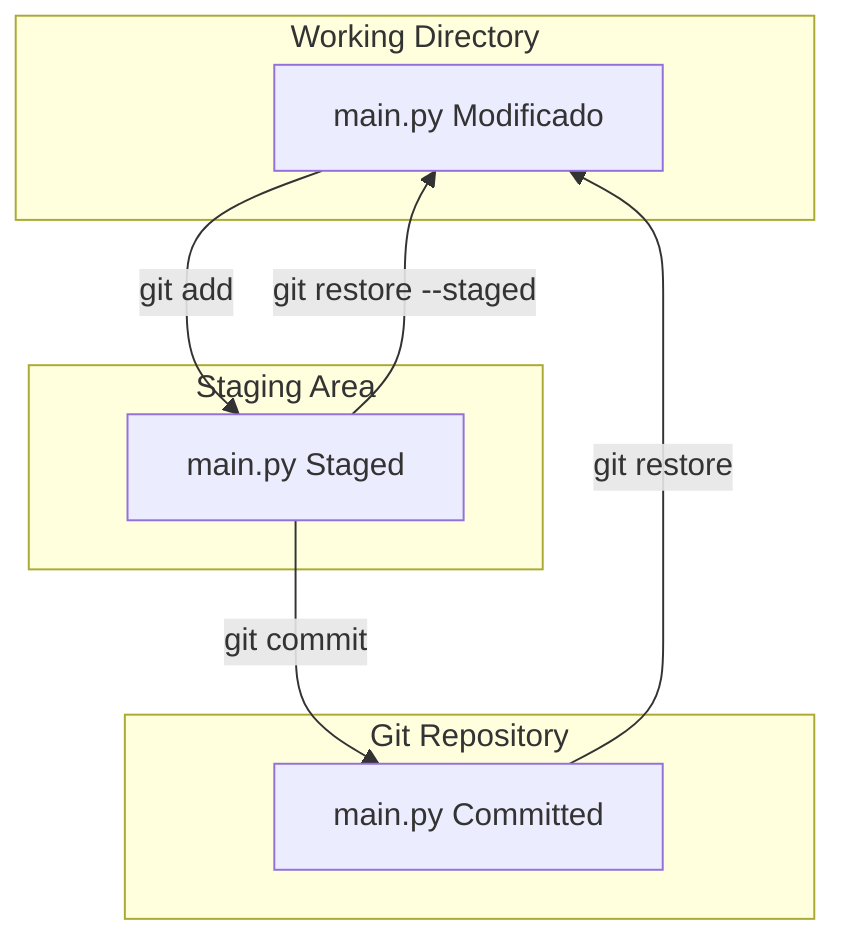
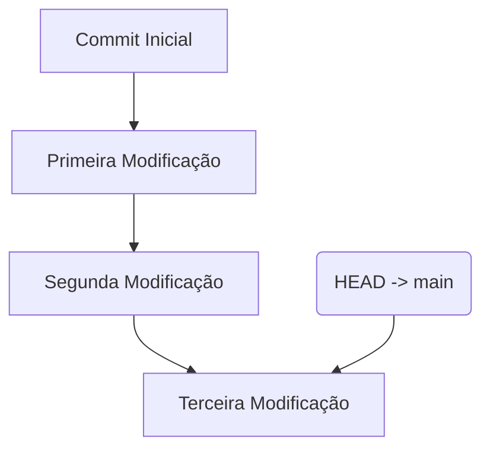
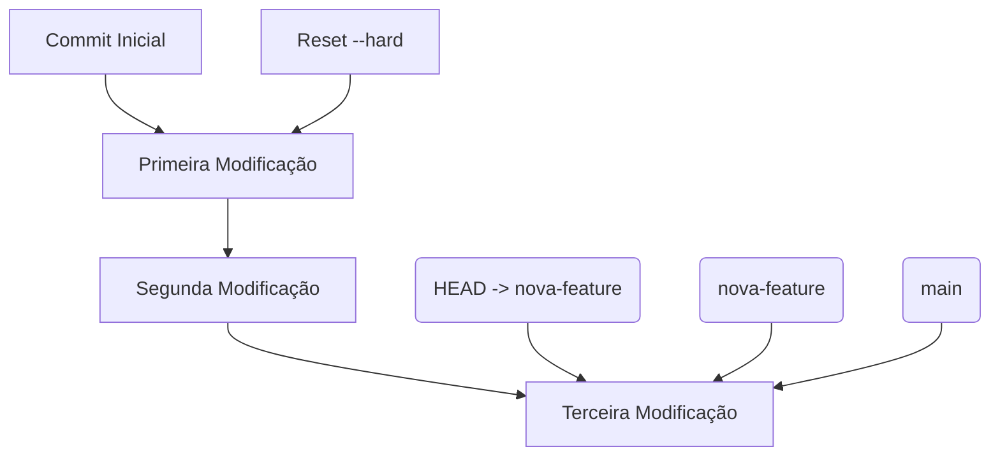
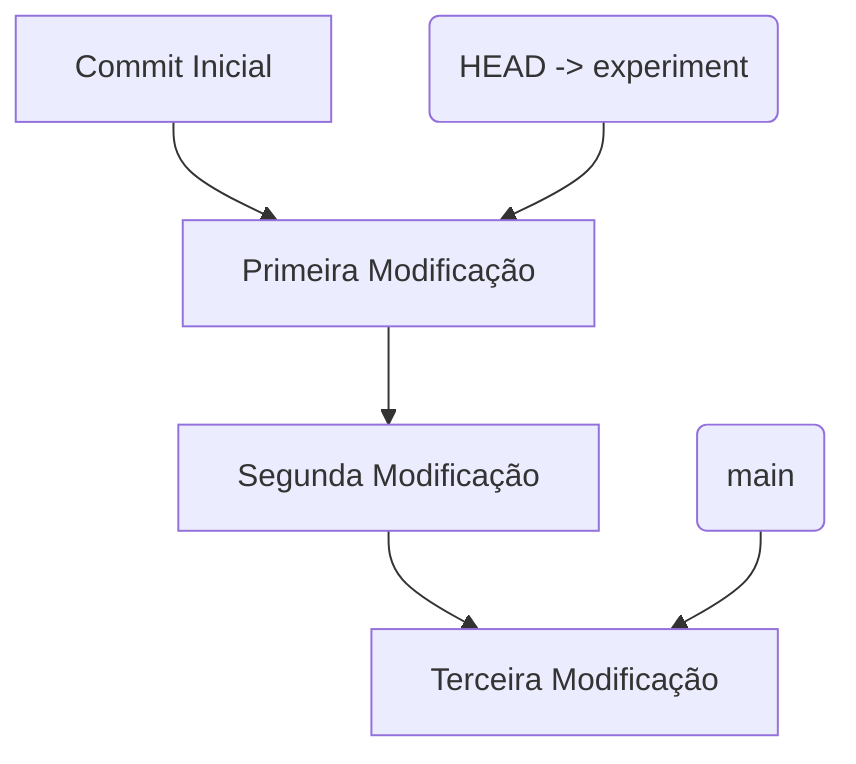
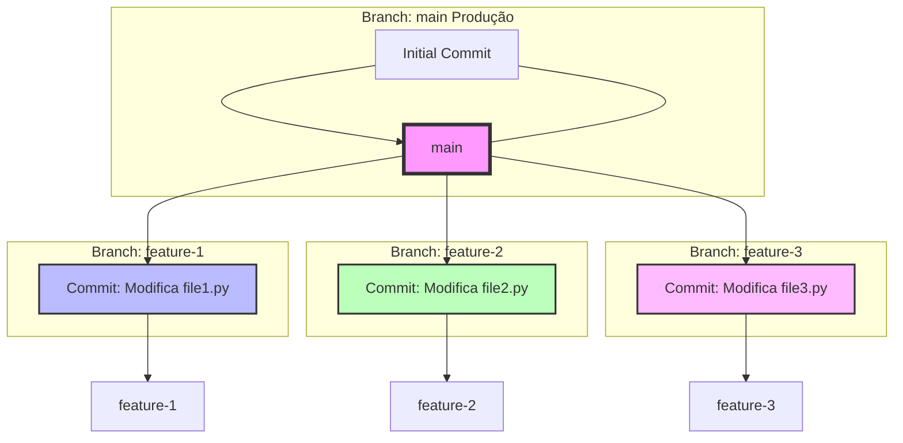
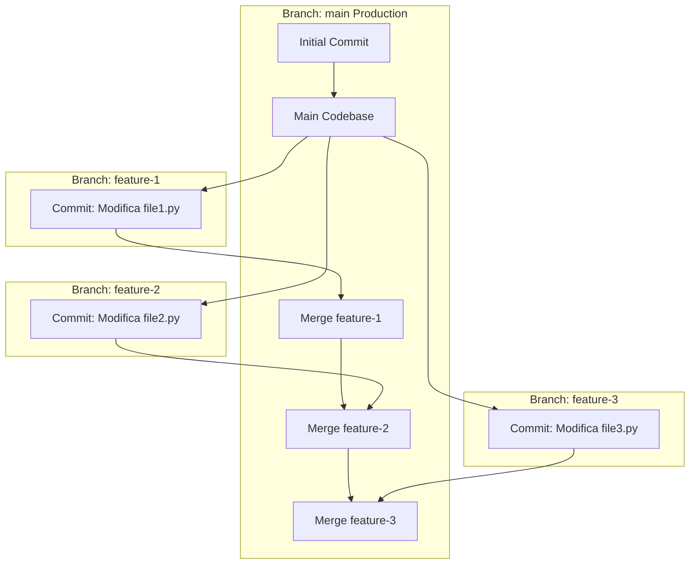

# Introdução ao Git

O Git é uma ferramenta fundamental para o versionamento de código e colaboração em equipes de desenvolvimento, especialmente quando múltiplas pessoas estão trabalhando em um mesmo projeto.
- [Documentação Oficial em português](https://git-scm.com/docs/git/pt_BR)

### Conhecimentos
- 6 Git - Sistema de controle de versões distribuído
	- 6.1. Evolução
	- 6.2. Comandos iniciais
		- 6.2.1.Init
		- 6.2.2.Add
		- 6.2.3.Status
		- 6.2.4.Config
		- 6.2.5.Commit
		- 6.2.6.Log
- 7 Versionamento em nuvem
	- 7.1. Serviços
		- 7.1.1.Github
		- 7.1.2.BitBucket
		- 7.1.3.Azure Repository
	- 7.2. Pull Requests
	- 7.3. Resolução de conflitos
   
## 📜 Problema no Desenvolvimento

### Desafios com o Desenvolvimento Colaborativo

Em projetos de software, é comum termos várias pessoas contribuindo ao mesmo tempo. Isso pode gerar conflitos de código, perda de trabalho e dificuldades em gerenciar diferentes versões de um mesmo arquivo. Antes do Git, essas situações frequentemente resultavam em erros e retrabalho, pois não existia um controle eficiente sobre as mudanças feitas no código.

**Perguntas para Reflexão:**

- **Como vocês costumam compartilhar código em equipe?** Será que enviar arquivos por e-mail ou usar drives compartilhados é a forma mais eficiente de colaborar?
- **Como garantir que todos os membros da equipe estão trabalhando na versão mais atual do código?** O que acontece quando diferentes pessoas fazem mudanças no mesmo arquivo simultaneamente?
- **Qual seria o impacto de perder uma semana de trabalho por causa de um conflito de código não resolvido?** Como podemos prevenir a perda de progresso no desenvolvimento de software?
- **Como vocês organizam as diferentes versões de um projeto?** Existe alguma estratégia que vocês usam para controlar quais mudanças foram feitas e por quem?
- **O que acontece quando queremos testar uma nova funcionalidade sem impactar o código que já está funcionando?** Como isolar essas mudanças para garantir que não introduzimos novos bugs?


### O Problema Sem Git

Sem o Git, não temos como recuperar o estado anterior do arquivo `main.py` em nenhum desses momentos. Se algo der errado, não há como voltar para uma versão anterior. Além disso, se tivermos conflitos ou dúvidas sobre o que foi mudado ao longo do tempo, não temos um histórico para consultar.

### Como o Git Resolveria Esse Problema

Se estivéssemos usando Git, cada uma dessas modificações poderia ter sido feita em um novo commit. Isso significaria que, a qualquer momento, poderíamos voltar a uma versão anterior do arquivo ou ver exatamente o que mudou entre os commits. Também poderíamos criar branches para testar novas funcionalidades sem afetar o código principal, garantindo que sempre tivéssemos uma versão estável do projeto.


Para entender mais sobre Git:
- [Sobre Git com Akita e Palestra de Linus Torvalds sobre Git](https://www.youtube.com/watch?v=6Czd1Yetaac)

## 🛠️ O Que é o Git?

Git é um programa que você instala em seu computador. Ele é usado para versionar arquivos de texto, como código-fonte, de maneira eficiente. Isso permite que você:

- **Versione Arquivos:** Mantenha um histórico detalhado de todas as mudanças feitas em seus arquivos.
- **Colabore Facilmente:** Trabalhe com muitos contribuidores de forma organizada.
- **Distribua Código:** Compartilhe seu código com outras pessoas, garantindo que todos estejam sincronizados com a versão mais recente.

## 💻 Como Instalar o Git

### Windows

1. Baixe o instalador do Git [aqui](https://git-scm.com/download/win).
2. Execute o instalador e siga as instruções.

### Linux

1. Abra o terminal.
2. Execute o comando:
   
   ```bash
   sudo apt-get install git
   ```

### Mac

1. Abra o terminal.
2. Execute o comando:
   
   ```bash
   brew install git
   ```

## 🎯 Configuração do Git

Antes de começar a usar o Git, precisamos configurar o nome e o e-mail do usuário:

```bash
git config --global user.name "Seu Nome"
git config --global user.email "seu.email@exemplo.com"
```

Os arquivos de configuração do Git que armazenam as configurações feitas com os comandos `git config` são armazenados em diferentes locais, dependendo do nível de configuração:

1. **Configurações Globais (`--global`)**:
   - As configurações globais são salvas no arquivo `.gitconfig` localizado no diretório home do usuário.
   - **Localização**:
     - **Linux/Mac**: `~/.gitconfig`
     - **Windows**: `C:\Users\SeuNomeDeUsuario\.gitconfig`
   - Você pode abrir esse arquivo em um editor de texto para visualizar ou editar as configurações.

2. **Configurações de Sistema (`--system`)**:
   - As configurações de sistema são aplicadas a todos os usuários da máquina e são armazenadas no arquivo de configuração global do sistema.
   - **Localização**:
     - **Linux**: `/etc/gitconfig`
     - **Windows**: Pode estar em um caminho como `C:\Program Files\Git\etc\gitconfig`
   - Essas configurações requerem permissões de administrador para serem alteradas.

3. **Configurações Locais (por repositório)**:
   - As configurações locais são específicas para um único repositório Git e são salvas no arquivo `config` dentro da pasta `.git` do repositório.
   - **Localização**:
     - No diretório do repositório Git: `.git/config`

Você pode visualizar as configurações atuais usando os seguintes comandos:

- **Para ver todas as configurações globais**:
  ```bash
  git config --global --list
  ```

Esses comandos vão listar as configurações e seus valores, permitindo que você veja detalhes como o nome de usuário e o e-mail configurados para o Git.

## 📂 Vamos Criar um Projeto Simples para entender o git

Vamos seguir um exemplo onde fazemos modificações em um arquivo Python e gerenciamos essas alterações usando Git. Este processo incluirá a criação de commits para cada modificação, além de explorar conceitos importantes como o `HEAD`, branches, e o comando `git checkout`.

### Criação de uma Pasta

Primeiro, vamos criar uma pasta para o nosso projeto:

```bash
mkdir aula-git
cd aula-git
```

### 1. Criação do Repositório e Primeira Modificação

#### Inicializando o Repositório

Vamos inicializar um novo repositório Git no diretório do projeto:

```bash
git init
```

Este comando cria um repositório Git vazio, onde começaremos a rastrear nossas alterações.

#### Criando e Adicionando o Arquivo ao Controle de Versão

Vamos criar um arquivo Python chamado `main.py`:

```bash
touch main.py
```

Abra o arquivo `main.py` e adicione o

 seguinte código:

```python
print("Hello, World!")
```

Agora, vamos verificar o estado do repositório para ver como o Git está reconhecendo o arquivo:

```bash
git status
```

Você verá que `main.py` está listado como um arquivo não rastreado (untracked). Vamos adicionar esse arquivo ao Git para que ele comece a ser rastreado:

```bash
git add main.py
```

Para adicionar todos os arquivos existentes no projeto

```bash
git add .
```

Remover um arquivo do git
```bash
git rm --cached main.py
```

Agora, faremos o primeiro commit para salvar o estado inicial do projeto:

```bash
git commit -m "Adiciona o arquivo main.py com um simples print"
```

Para verificar o commit 
```bash
git log
```

### 2. Primeira Modificação e Novo Commit

Agora, vamos modificar o arquivo `main.py`:

```python
print("Hello, World!")
print("Primeira Modificação")
```

Depois de fazer a modificação, vamos verificar novamente o estado dos arquivos:

```bash
git status
```


### Temos duas opções - Explicação do Fluxo:

- **Opção 1: `git add`**:
    - **`git add main.py`**: As mudanças no `main.py` são movidas para a Staging Area.
    - **`git commit -m 'Update main.py'`**: Um novo commit é criado, e as mudanças são salvas na caixa do Git Repository.

- **Opção 2: `git restore`**:
    - **`git restore main.py`**: O arquivo `main.py` no Working Directory é restaurado a partir da última versão salva no Git Repository, descartando as mudanças feitas localmente.

O Git mostrará que o arquivo `main.py` foi modificado. Vamos adicionar essa modificação à área de staging e fazer um novo commit:

### 2. Primeira Modificação e Novo Commit

```bash
git add main.py
```

### Git status

Ao realizar o Git status observamos que temos 2 opções novamente


### Explicação do Fluxo:

- **Opção 1: `git commit`**:
    - **`git commit -m 'Update main.py'`**: Cria um novo commit no Git Repository, salvando as mudanças que estavam na Staging Area.

- **Opção 2: `git restore --staged`**:
    - **`git restore --staged main.py`**: Remove o arquivo `main.py` da Staging Area, retornando-o ao Working Directory sem as mudanças serem cometidas. Ele volta ao estado antes de ser adicionado à Staging Area.

Vamos seguir com o commit

### 2. Primeiro Save no Commit

```bash
git commit -m "Adiciona a primeira modificação ao arquivo main.py"
```

### Fluxo



### 3. Segunda Modificação e Novo Commit

Vamos modificar o arquivo novamente:

```python
print("Hello, World!")
print("Primeira Modificação")
print("Segunda Modificação")
```

Novamente, adicionamos e fazemos um commit dessas mudanças:

```bash
git add main.py
git commit -m "Adiciona a segunda modificação ao arquivo main.py"
```

### 4. Terceira Modificação e Novo Commit

Finalmente, vamos adicionar uma terceira modificação:

```python
print("Hello, World!")
print("Primeira Modificação")
print("Segunda Modificação")
print("Terceira Modificação")
```

E, novamente, fazemos o commit:

```bash
git add main.py
git commit -m "Adiciona a terceira modificação ao arquivo main.py"
```

### 5. Verificando o Histórico de Commits

Agora, podemos usar o `git log` para visualizar o histórico de commits e ver todas as modificações que fizemos até agora:

```bash
git log
```

O `git log` exibirá uma lista de todos os commits, mostrando as mensagens e os identificadores únicos (hashes) dos commits.

### 6. Entendendo o `HEAD`

O `HEAD` é um apontador especial que indica o commit atual em que você está trabalhando. Normalmente, o `HEAD` aponta para a branch `main`, que é a linha principal de desenvolvimento do projeto.

**Ilustração:**



Aqui, o `HEAD` está apontando para o commit mais recente na branch `main`. Isso significa que todas as operações, como novos commits, partirão desse ponto.

### 7. Trabalhando com Branches

Branches são como linhas do tempo paralelas no seu repositório. Elas permitem que você trabalhe em diferentes funcionalidades ou correções de bugs sem afetar a `main`.

**Criando uma Nova Branch:**

Vamos criar uma nova branch chamada `nova-feature` para trabalhar em uma nova funcionalidade:

```bash
git branch nova-feature
```

Agora, podemos mudar para essa branch e começar a trabalhar nela:

```bash
git checkout nova-feature
```

Isso muda o `HEAD` para a nova branch `nova-feature`, o que significa que qualquer commit feito agora será registrado nessa branch.
```python
print("Hello, World!")
print("Primeira Modificação")
print("Segunda Modificação")
print("Terceira Modificação")

print("Quarta Modificação")
```

```bash
git add main.py
```

```bash
git commit -m "Quarta modificação"
```

**Ilustração:**


Aqui, a `nova-feature` diverge da `main` a partir do mesmo ponto, permitindo que você desenvolva funcionalidades de forma isolada.

### 8. Usando `git checkout` para Navegar Entre Commits e Branches

O comando `git checkout` permite que você navegue entre diferentes branches e commits. Se você quiser voltar para a branch `main`, pode usar:

```bash
git checkout main
```

Se quiser explorar o estado do projeto em um commit anterior, use:

```bash
git checkout <hash_do_commit>
```

Isso coloca você em um estado de "detached HEAD", onde você pode ver o estado do projeto naquele momento específico.

### 9. Usando `git reset` para Voltar ao Commit Anterior (Sem demonstração)

Se você deseja desfazer as últimas mudanças e voltar ao estado de um commit anterior, pode usar o `git reset`. Cuidado ao utilizar o git reset, pois ele limpa todo seu historico daquela branch

- **`git reset --hard <idCommit>`**: Volta para o commit anterior e descarta completamente todas as alterações feitas após esse commit.

**Ilustração com Mermaid:**



Aqui, o comando `git reset --hard` move o `HEAD` de volta para a "Primeira Modificação", descartando todas as alterações feitas após esse ponto.

### 10. Criando uma Branch a Partir de um Commit Anterior

Se você quer preservar o estado atual do projeto, mas precisa voltar a um commit anterior para experimentar algo novo, pode criar uma nova branch a partir desse commit:

```bash
git checkout -b experiment <hash_do_commit>
```

Isso cria uma nova branch chamada `experiment`, começando a partir do commit que você especificou.

**Ilustração com Mermaid:**



### 11. Excluindo uma Branch
É comum que um repositório do Git tenha diversos branches. Eles são uma ótima maneira de trabalhar com recursos (features) diferentes enquanto isolamos o código novo da base de código principal.

Os repositórios geralmente têm um branch master ou main para a base de código principal. Os desenvolvedores, então, criam outros branches para trabalhar em recursos diferentes.

Ao concluir o trabalho em um recurso, recomenda-se excluir o branch.

```bash
git branch -d <branch>
```

Volte a branch main e delete a nova branch criada:

```bash
git checkout main
```

verificando todas as branch: 

```bash
git branch
```

Excluindo a branch experiment:

```bash
git branch -d experiment
```


### Caso real

Vamos expandir o exemplo para incluir três branches diferentes, cada uma com uma modificação específica em um arquivo, e um branch `main` que representa o código em produção.
Antes de começar, exclua todas as branches adicionais, mantendo apenas a branch principal (main).

### Situação:

1. **Branch `main`**: Contém o código de produção, sem as novas funcionalidades que estamos desenvolvendo.
2. **Branch `feature-1`**: Modifica o `file1.py` para adicionar uma nova funcionalidade.
3. **Branch `feature-2`**: Modifica o `file2.py` para adicionar outra funcionalidade.
4. **Branch `feature-3`**: Modifica o `file3.py` para adicionar uma terceira funcionalidade.

### Passos:

1. **Criar e mudar para a branch `feature-1`**:
    ```bash
    git branch feature-1
    git checkout feature-1
    # Crie um arquivo file1.py e fazer commit
    git add file1.py
    git commit -m "Adiciona nova funcionalidade em file1.py"
    ```

2. **Criar e mudar para a branch `feature-2`**:
    ```bash
    git checkout main
    git branch feature-2
    git checkout feature-2
    # Modificar file2.py e fazer commit
    git add file2.py
    git commit -m "Adiciona nova funcionalidade em file2.py"
    ```

3. **Criar e mudar para a branch `feature-3`**:
    ```bash
    git checkout main
    git checkout -b feature-3
    # Modificar file3.py e fazer commit
    git add file3.py
    git commit -m "Adiciona nova funcionalidade em file3.py"
    ```

### Diagrama Mermaid:

Aqui está o diagrama que ilustra essas operações:



### Explicação do Diagrama:

- **Branch `main`**: Representa o código em produção, onde não foram aplicadas as novas funcionalidades.
- **Branch `feature-1`**: Diverge do `main` após o commit inicial e inclui uma modificação em `file1.py`.
- **Branch `feature-2`**: Diverge do `main` após o commit inicial e inclui uma modificação em `file2.py`.
- **Branch `feature-3`**: Diverge do `main` após o commit inicial e inclui uma modificação em `file3.py`.

Cada branch permite que você trabalhe em funcionalidades diferentes de forma isolada. Os commits em cada branch representam o trabalho feito nessas funcionalidades. Quando as funcionalidades estiverem prontas e testadas, você poderá mesclar (`merge`) essas branches de volta ao `main` para que as novas funcionalidades sejam incorporadas ao código de produção.

Certifique-se de criar a margem primeiro. O último desenvolvedor a fazer alterações é quem acaba enfrentando os problemas.

Vamos continuar o exemplo, adicionando os comandos para mesclar as branches de funcionalidades (`feature-1`, `feature-2`, `feature-3`) de volta ao `main` quando as funcionalidades estiverem prontas.

### Situação Revisada:

1. **Branch `main`**: Contém o código de produção.
2. **Branch `feature-1`**: Modifica o `file1.py` para adicionar uma nova funcionalidade.
3. **Branch `feature-2`**: Modifica o `file2.py` para adicionar outra funcionalidade.
4. **Branch `feature-3`**: Modifica o `file3.py` para adicionar uma terceira funcionalidade.


### Mesclando as Branches de Funcionalidade no `main`:

Depois que cada funcionalidade estiver pronta, você pode mesclar essas branches de volta ao `main`. Aqui estão os passos:

1. **Mesclar `feature-1` no `main`**:
    ```bash
    git checkout main
    git merge feature-1
    ```

2. **Mesclar `feature-2` no `main`**:
    ```bash
    git merge feature-2
    ```

3. **Mesclar `feature-3` no `main`**:
    ```bash
    git merge feature-3
    ```

### Diagrama Mermaid Atualizado:

Aqui está o diagrama que ilustra essas operações, incluindo as etapas de merge:



### Explicação do Diagrama Atualizado:

- **Branch `main`**: Representa o código de produção. Inicialmente, contém apenas o commit inicial e o código base.
- **Branches de Funcionalidade**:
  - **`feature-1`**: Contém a modificação em `file1.py`.
  - **`feature-2`**: Contém a modificação em `file2.py`.
  - **`feature-3`**: Contém a modificação em `file3.py`.
- **Mesclagens (`Merges`)**:
  - Cada branch de funcionalidade é mesclada de volta ao `main`, integrando as novas funcionalidades no código de produção.


### Conclusão:

Esse fluxo permite que cada funcionalidade seja desenvolvida em isolamento, testada individualmente e, quando pronta, integrada ao código de produção sem afetar o `main` até que tudo esteja pronto. Isso torna o processo de desenvolvimento mais seguro e organizado, minimizando conflitos e problemas na integração das funcionalidades.